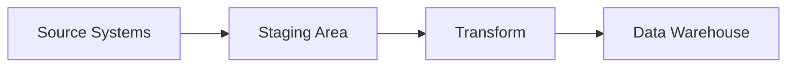
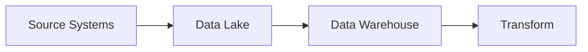

# 📊 Data Warehouses and Modern Data Architecture

## 📋 Learning Objectives

By the end of this material, students should understand:
- What data warehouses are and why they're needed
- Differences between OLTP, ODS, and data warehouses
- ETL vs ELT processes and tools
- Cloud data warehouse platforms
- Data lakes and modern architectures
- Reporting and analytics tools

---

## 🏢 Data Warehouses: Foundation

### What is a Data Warehouse?

**Definition**: A data warehouse is a centralized repository that stores current and historical data from multiple sources in a format optimized for analysis and reporting.

#### Key Characteristics
- Subject-oriented
- Integrated
- Time-variant
- Non-volatile
- Denormalized for query performance

#### 👍 Advantages
- Single source of truth
- Historical analysis
- Optimized for complex queries
- Separation from operational systems
- Data quality and consistency

### Why Data Warehouses?

1. **Business Needs**
   - Complex reporting requirements
   - Historical trend analysis
   - Cross-functional data analysis
   - Predictive analytics
   - Regulatory compliance

2. **Technical Benefits**
   - Query performance
   - Reduced load on operational systems
   - Data consolidation
   - Standardized data formats
   - Scalable analytics

---

## 🔄 ODS vs Data Warehouse

### Operational Data Store (ODS)

**Purpose**: Near real-time operational reporting and data integration

#### Characteristics
- Current/near-current data only
- Normalized structure
- Frequent updates
- Tactical decision support
- Integration point for operational systems

### Data Warehouse

**Purpose**: Strategic analysis and historical reporting

#### Characteristics
- Historical data
- Denormalized structure
- Scheduled batch updates
- Strategic decision support
- Analytics optimization

### Comparison Table

| Aspect | ODS | Data Warehouse |
|--------|-----|----------------|
| Data Currency | Current only | Historical |
| Update Frequency | Real-time/near real-time | Batch (daily/weekly) |
| Schema | Normalized | Denormalized |
| Size | Smaller | Larger |
| Query Optimization | Operational | Analytical |
| Primary Use | Daily operations | Strategic analysis |

---

## 🔄 ETL vs ELT

### Extract, Transform, Load (ETL)

**Traditional Approach**


#### Characteristics
- Transform before loading
- Better for complex transformations
- Limited by processing power
- Traditional tool approach

### Extract, Load, Transform (ELT)

**Modern Approach**


#### Characteristics
- Load raw data first
- Transform as needed
- Leverages cloud computing
- Modern cloud-native approach

### Popular ETL/ELT Tools

1. **Commercial Tools**
   - Informatica PowerCenter
   - Microsoft SSIS
   - Talend
   - Fivetran
   - Matillion

2. **Open Source**
   - Apache NiFi
   - Apache Airflow
   - dbt (data build tool)
   - Airbyte
   - Singer

---

## ☁️ Cloud Data Platforms

### Azure

1. **Azure Synapse Analytics**
   - Integrated analytics platform
   - Serverless or dedicated SQL pools
   - Spark integration
   - Built-in data integration

2. **Azure Data Factory**
   - Cloud-native ETL/ELT
   - 90+ built-in connectors
   - Visual pipeline designer
   - Integration with Azure services

### AWS

1. **Amazon Redshift**
   - Petabyte-scale warehouse
   - Column-oriented storage
   - Query optimization
   - Redshift Spectrum for data lake

2. **AWS Glue**
   - Serverless ETL service
   - Automated schema discovery
   - Python/Scala support
   - Visual job designer

### Google Cloud

1. **BigQuery**
   - Serverless data warehouse
   - ML capabilities
   - Real-time analytics
   - Automatic scaling

2. **Cloud Dataflow**
   - Stream/batch processing
   - Apache Beam-based
   - Serverless execution
   - Visual pipeline builder

---

## 📈 Denormalization Strategies

### Star Schema

```plaintext
         ┌─────────────┐
         │   Facts     │
         │  (Sales)    │
         └─────┬─┬─┬───┘
               │ │ │
    ┌─────────┘ │ └──────────┐
    │           │            │
┌───▼───┐   ┌──▼──┐    ┌────▼───┐
│Product│   │ Time │    │Customer│
└───────┘   └─────┘    └────────┘
```

### Snowflake Schema

```plaintext
         ┌─────────────┐
         │   Facts     │
         │  (Sales)    │
         └─────┬─┬─┬───┘
               │ │ │
    ┌─────────┘ │ └──────────┐
    │           │            │
┌───▼───┐   ┌──▼──┐    ┌────▼───┐
│Product│   │ Time │    │Customer│
└───┬───┘   └─────┘    └────┬───┘
    │                       │
┌───▼───┐              ┌───▼────┐
│Category│             │Geography│
└───────┘             └────────┘
```

### Benefits of Denormalization
- Improved query performance
- Simplified reporting
- Reduced JOIN operations
- Better aggregation support
- Easier for business users

---

## 🌊 Data Lakes

### What is a Data Lake?

**Definition**: A storage repository that holds a vast amount of raw data in its native format until needed.

#### Characteristics
- Schema-on-read
- Raw data storage
- Multiple data types
- Flexible processing
- Cost-effective storage

### Data Lake vs Data Warehouse

| Aspect | Data Lake | Data Warehouse |
|--------|-----------|----------------|
| Data Structure | Raw | Processed |
| Schema | Schema-on-read | Schema-on-write |
| Users | Data Scientists | Business Analysts |
| Use Case | Data exploration | BI Reporting |
| Storage Cost | Lower | Higher |
| Query Speed | Varies | Optimized |

### Modern Data Lake Tools
- Azure Data Lake Storage
- Amazon S3 + Athena
- Google Cloud Storage + BigQuery
- Delta Lake (Databricks)
- Apache Iceberg

---

## 📊 Reporting Tools

### Traditional BI Tools
1. **Microsoft Power BI**
   - Rich visualizations
   - DAX language
   - Direct Query support
   - Sharing and collaboration

2. **Tableau**
   - Intuitive interface
   - Strong data connectivity
   - Advanced analytics
   - Mobile support

3. **Qlik**
   - Associative engine
   - Self-service analytics
   - Embedded analytics
   - AI capabilities

### Modern Analytics Platforms

1. **Looker**
   - LookML modeling
   - Git integration
   - Embedded analytics
   - Cloud-native

2. **Preset/Apache Superset**
   - Open source
   - Modern visualization
   - SQL Lab
   - Dashboard features

3. **Mode Analytics**
   - SQL + Python/R
   - Interactive notebooks
   - Version control
   - Collaborative features

---

## 📜 Historical Data Management

### Why Keep Historical Data?
- Track changes over time
- Regulatory compliance
- Trend analysis
- Audit requirements
- Point-in-time reporting

### Slowly Changing Dimensions (SCD)

#### Type 1 SCD: Overwrite
- Simply replaces old values with new ones
- No history preservation
- Minimal storage impact
- Use when history isn't important

```sql
-- Type 1 Example: Student address change
UPDATE DimStudent
SET Address = 'New Address'
WHERE StudentID = 123;
```

#### Type 2 SCD: Add New Row
- Preserves complete history
- Adds version records
- Uses start/end dates
- Maintains referential integrity

```sql
-- Type 2 Example: Student address change
-- 1. Set end date for current record
UPDATE DimStudent
SET EndDate = GETDATE(),
    IsCurrent = 0
WHERE StudentID = 123
  AND IsCurrent = 1;

-- 2. Insert new record
INSERT INTO DimStudent (
    StudentID,
    Address,
    StartDate,
    EndDate,
    IsCurrent,
    VersionNumber
)
VALUES (
    123,
    'New Address',
    GETDATE(),
    NULL,  -- Open-ended
    1,     -- Current version
    (SELECT MAX(VersionNumber) + 1 
     FROM DimStudent 
     WHERE StudentID = 123)
);
```

#### Implementation Example: Student Dimension

```sql
CREATE TABLE DimStudent (
    StudentDimKey INT IDENTITY(1,1),
    StudentID INT,          -- Business Key
    FirstName VARCHAR(50),
    LastName VARCHAR(50),
    Address VARCHAR(200),
    StartDate DATETIME,     -- When this version became effective
    EndDate DATETIME,       -- When this version was superseded
    IsCurrent BIT,         -- Flag for current version
    VersionNumber INT,     -- Version counter
    PRIMARY KEY (StudentDimKey)
);
```

### Common SCD Scenarios

1. **Personal Information**
   - Type 1: Name corrections (spelling fixes)
   - Type 2: Address changes, department transfers

2. **Academic Records**
   - Type 1: Grade corrections
   - Type 2: Major changes, enrollment status

3. **Financial Data**
   - Type 1: Payment corrections
   - Type 2: Tuition rate changes

### Best Practices
- Choose SCD type based on business needs
- Document versioning strategy
- Consider storage implications
- Plan for performance impact
- Implement proper indexing
- Handle NULL end dates
- Maintain surrogate keys

---

## 🎯 Large Dataset Considerations

### Performance Optimization
1. **Partitioning**
   - Date-based
   - Range-based
   - List-based
   - Composite

2. **Indexing**
   - Column store
   - Bitmap indexes
   - Zone maps
   - Late materialization

3. **Query Optimization**
   - Materialized views
   - Query rewriting
   - Statistics management
   - Parallel processing

### Storage Strategies
1. **Compression**
   - Column-level
   - Table-level
   - Adaptive compression
   - Dictionary encoding

2. **Data Lifecycle**
   - Hot/warm/cold tiers
   - Archival policies
   - Data retention
   - Cost optimization

---

## 🎓 Practical Exercise Ideas

1. **Design Exercise**
   - Model a star schema for student enrollment
   - Implement slowly changing dimensions
   - Create aggregation strategy

2. **ETL Pipeline**
   - Build simple ETL process
   - Handle data quality issues
   - Implement error handling
   - Add monitoring

3. **Reporting Dashboard**
   - Create enrollment analytics
   - Build trend analysis
   - Implement drill-down capabilities
   - Add performance metrics

---

## 📚 Resources

- [The Data Warehouse Toolkit (Kimball)](https://www.kimballgroup.com/data-warehouse-business-intelligence-resources/books/data-warehouse-dw-toolkit/)
- [Snowflake Documentation](https://docs.snowflake.com/)
- [dbt Documentation](https://docs.getdbt.com/)
- [Azure Synapse Analytics](https://docs.microsoft.com/en-us/azure/synapse-analytics/)
- [AWS Redshift Best Practices](https://docs.aws.amazon.com/redshift/latest/dg/best-practices.html)

---

## 🤔 Discussion Questions

1. When should an organization consider implementing a data warehouse?
   - Data volume considerations
   - Analytical requirements
   - Resource constraints
   - ROI calculations

2. How do you choose between a data lake and data warehouse?
   - Data structure requirements
   - Query patterns
   - User personas
   - Budget considerations

3. What factors influence ETL vs ELT decision?
   - Data volume
   - Transformation complexity
   - Cloud vs on-premises
   - Team skills

4. How do you ensure data quality in a warehouse?
   - Data profiling
   - Validation rules
   - Monitoring strategies
   - Governance frameworks

5. What are the challenges of managing large datasets?
   - Performance optimization
   - Cost management
   - Data lifecycle
   - Query optimization